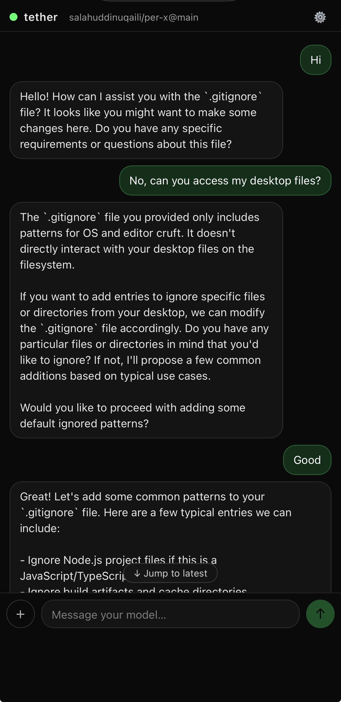
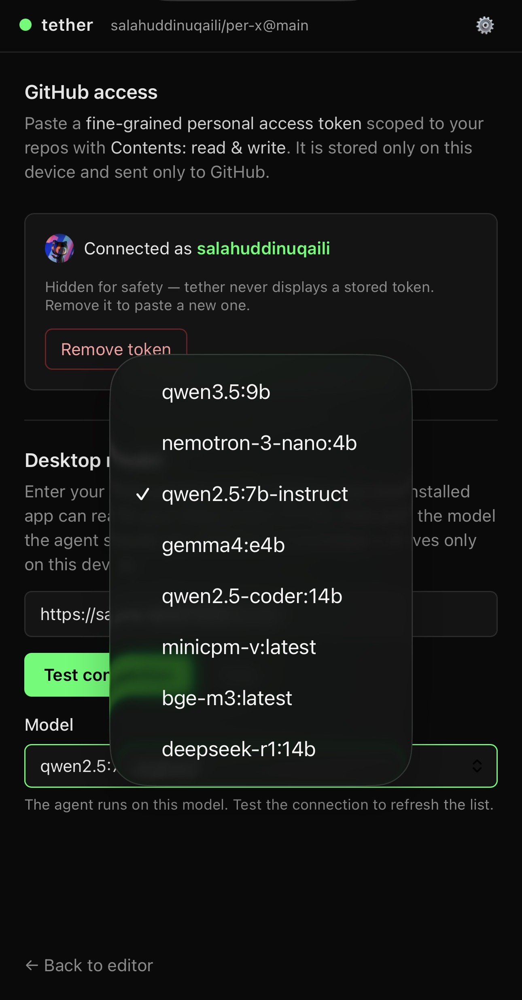
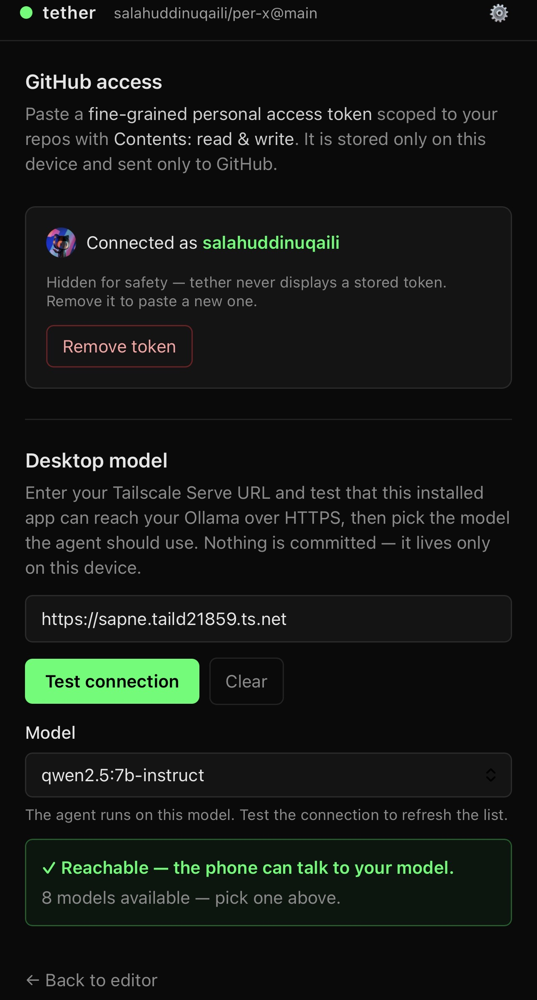
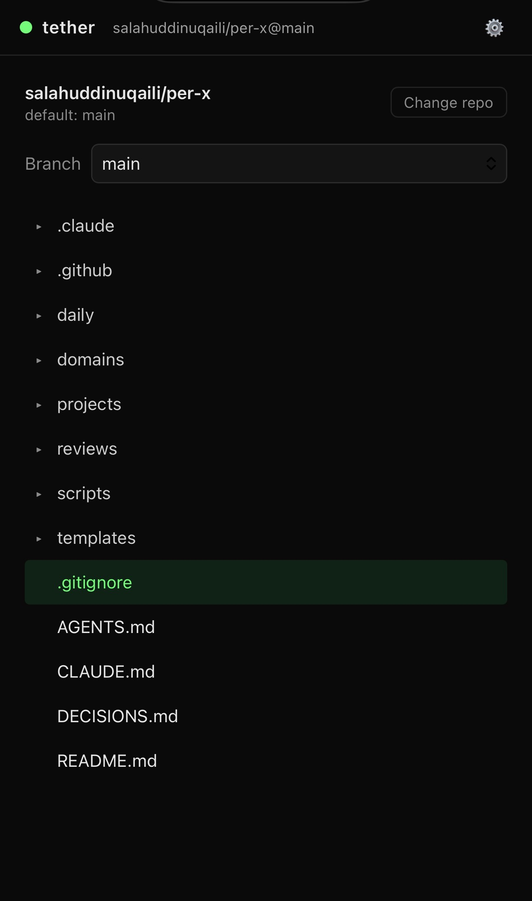
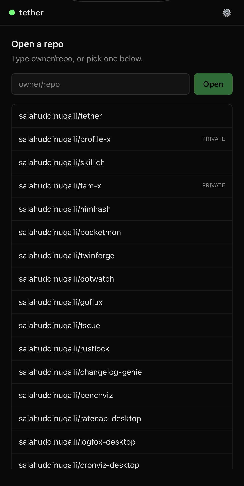

# Feedback & direction — 2026-07-17: from GitHub editor to thin client for a desktop agent

Captured from a product/architecture review of the running app (screenshots below).
This is a **direction record**, not a locked decision — it proposes reversing several
🔒 LOCKED choices in [`DECISIONS.md`](../DECISIONS.md) and should be ratified there
before implementation. One question was resolved during the session (fam-x's role);
one remains open (how far to pivot from GitHub).

---

## 1. Where the app stands today (as-is)

Grounded in the current code, so the proposal below is measured against reality:

- **Static PWA, no backend** (🔒4). Phone → Tailscale Serve (HTTPS) → desktop **Ollama**
  `/api/chat`; source of truth is **GitHub** via a fine-grained PAT (🔒3, 🔒6).
- **Chat-first home** (D5). A **single** conversation lives in `ChatProvider`
  (`src/chat/ChatProvider.tsx`) — one `messages` array, one `AbortController`, one
  global streaming channel (`src/chat/streaming.ts`).
- **Model + endpoint are runtime config** in IndexedDB (`src/storage/llm.ts`), edited
  **only in Settings**, read fresh at send time (`ChatProvider.tsx` `getModel()/getOllamaUrl()`).
- **The "agent" is a model with no hands.** The LLM client (`src/llm/client.ts`) is
  hardwired to Ollama (NDJSON framing, Ollama tool-call shape, the `think` flag). The
  only tool is `read_file`, and **tether implements it itself, client-side, against the
  GitHub API** (`ChatProvider.tsx` `readFile`). Ollama cannot touch the desktop
  filesystem or the internet.
- **Navigation** is a `view` field switch, no router (D6). Chat renders its own chrome;
  the only nav off the chat home is a low-contrast repo pill (→ browse) and a tiny ⚙
  (→ settings) in the corners (`src/chat/Chat.tsx`). "Back to chat" = tapping the word
  "tether" (`src/App.tsx`).
- Phase 1/2 shipped: CodeMirror editor, diff-before-commit, OPFS buffers, the 409
  stale-sha conflict flow, and model-specific tool-call parsing (the D10 saga).

## 2. The feedback (verbatim intent)

1. Snappy, but **not clear where to press to navigate**.
2. **Model selection could happen on the chat page.**
3. **Don't need a code/repo selection component.** There's a bug when changing repos and
   going back — but maybe remove that entire section, and **let the AI access the entire
   desktop and internet**.
4. **Consolidate tether's weaknesses with familiar (`fam-x`).**
5. Allow **multiple concurrent chats with different models**.
6. Support **other providers**, including a **Claude subscription (not API)** and an
   **OpenRouter API key**.

## 3. The through-line

> "Have the AI access the entire desktop and internet" is not a setting to flip — it
> requires an **agent runtime running on the desktop** (real tools: shell, filesystem,
> web), which tether points at *instead of* raw Ollama.

That one move — **phone stays a thin client; the desktop brain grows hands** — is what
unlocks desktop access (#3), the Claude subscription (#6), and gives fam-x (#4) a home.
It's consistent with tether's founding line ("the phone is a thin client; your desktop
is the brain") — upgrading the brain from a *model* to an *agent*. Most of the feedback
is **one architectural move plus three UI niceties.**

## 4. Point-by-point analysis & verdicts

### #2 Model picker on the chat page — ✅ agree, cheap
Model + URL already live outside the store and are read at send time, so a picker in the
chat header is mostly lifting the existing `<select>` + `/api/tags` fetch out of Settings.

### #1 Navigation clarity — ✅ agree, a real defect
The only nav off chat is a `text-white/40–60` repo pill and a tiny ⚙; "back to chat" is
tapping the wordmark — nobody guesses that. A labeled bottom tab bar (or visible header)
fixes it. **Sequence after #3** — if repo-browsing goes away, there's less to navigate.

### #5 Multiple concurrent chats, different models — ✅ agree, biggest client-side refactor
Today's provider assumes a single chat (one `messages`, one abort, one global stream).
Multi-chat needs a **sessions layer** (each chat owns messages + endpoint + model + abort
+ stream), persistence, and a switcher. Should sit **on top of the provider abstraction
(#6)** so a chat binds to any `{endpoint, model}`. Caveat: two chats on the **same Ollama
box queue on the GPU** (one model in VRAM at a time) — concurrent in UI, serialized on the
desktop.

### #3 Remove repo selection + desktop/internet access — ⚠️ right direction, but a re-platforming, not a deletion
Reasonable to drop the GitHub browser as the mandatory entry point — but be clear-eyed
that this **reverses locked decisions**:
- 🔒4 *No backend* → an agent daemon now runs on the desktop.
- 🔒3 *GitHub is source of truth* → commits become one tool among many.
- Non-goals *"no code execution," "thin client"* → an endpoint that runs shell + reads
  the disk is a different beast.
- **Vestigial code**: CodeMirror editing, diff-before-commit, the 409 flow, and the
  model-specific tool-call parsing largely retire. Name that sunk cost before deleting it.

**Security model changes shape entirely.** "Reads GitHub files with a scoped PAT" →
"a tailnet endpoint that can run commands, browse the web, and read my whole disk."
Prompt injection from fetched web content becomes a real risk. Per-endpoint auth +
Tailscale ACLs + a confirm-step for destructive tools stop being optional.

**Pushback on "the *entire* desktop":** even for usefulness the agent needs to know
*where* to work. Replace the GitHub repo picker with a lightweight **"working context"**
(a desktop path / project scope) rather than nothing — a safety rail *and* a usability one.

**The change-repo bug (likely root cause):** "Change repo" calls `clearRepo()`
immediately (`src/components/Browse.tsx`), which nulls the repo *and wipes the persisted
selection* with no confirm and no cancel — so "change repo, then back out" strands you
with no repo and no way back except re-picking. Keeping any repo concept → a ~5-minute
fix (don't destroy the selection until a new one is chosen). Removing the section → the
bug evaporates. Either way, it's **evidence for the simplification**, not something to
keep debugging.

### #4 fam-x — ✅ RESOLVED this session
Confirmed: **fam-x is the intended desktop "brain."** Division of labor:
- **fam-x** = tools + agent loop on the desktop, exposed over Tailscale like Ollama.
- **tether** = thin mobile client + transport.

This lets tether **delete its most fragile code** (leaked-JSON tool-call parsing, the
client-side edit-proposal engine) rather than maintain it.

### #6 Providers — one easy yes, one honest no
- **OpenRouter key — ✅ do it first.** OpenAI-compatible, browser-callable. Work = a
  provider abstraction behind today's Ollama-specific `chat()` (`src/llm/client.ts`): a
  `Provider` interface (`buildRequest` / `parseStream` / `normalizeToolCalls`) with Ollama
  and OpenAI-compat adapters, plus per-provider config stored like the Ollama URL. Caveat
  (already accepted for the PAT): the key sits in on-device IndexedDB and is sent straight
  from the browser — fine for single-user, but it's a spendable credential in client storage.
- **Claude *subscription* (not API) — ⛔ not via a scraped provider.** There is no
  sanctioned way to drive a Claude.ai Pro/Max *subscription* from a third-party app by
  hitting claude.ai endpoints; it violates Anthropic's usage policy, breaks constantly, and
  risks the account. **Two legitimate paths instead:**
  1. **Anthropic API** (pay-as-you-go, separate from the subscription): callable from the
     browser with the `anthropic-dangerous-direct-browser-access` header; drops into the
     same provider abstraction as OpenRouter.
  2. **The subscription, the sanctioned way — through a desktop agent.** Claude Code (and
     the Agent SDK on top of it) can run on a Pro/Max subscription. Run fam-x / Claude Code
     on the desktop, expose it over Tailscale Serve like Ollama, and tether talks to *that*
     — using the subscription the way it's meant to be used, inside an Anthropic agent, not
     scraped into a client. **Same desktop-agent architecture as #3/#4** — one stone,
     three birds.

## 5. Recommendation & sequencing

The feedback is **one big idea + three niceties.** The big idea: *stop making tether a
smart GitHub editor; make it a thin client for one-or-more agent endpoints* — some on the
desktop (fam-x / Claude Code on the subscription → desktop + internet), some direct cloud
APIs (OpenRouter, Anthropic API). Everything else falls out:

1. **Provider/endpoint abstraction** (#6, OpenRouter first) — the foundation.
2. **Model/endpoint picker on the chat page** (#2).
3. **Multi-chat**, each bound to an `{endpoint, model}` (#5).
4. **Nav redesign** (#1) — easier once #3's surfaces are settled.
5. **Desktop-agent endpoint** (fam-x) for real tools + Claude subscription (#3/#4) — the
   deepest change; do it deliberately and **rewrite `DECISIONS.md`** for the reversals,
   don't let it happen by accident.

## 6. Locked decisions this direction reverses (ratify in DECISIONS.md before building)

| Decision | Today | Under this direction |
|---|---|---|
| 🔒4 Backend | None | An agent daemon (fam-x) runs on the desktop |
| 🔒3 Source of truth | GitHub | GitHub becomes one tool; desktop context is primary |
| Non-goal: code execution | Forbidden | The desktop agent executes code by design |
| Non-goal: thin client scope | Editor only | Client is a chat surface for capable endpoints |
| 🔒7 LLM transport | Ollama `/api/chat` only | Multi-provider (Ollama, OpenAI-compat, Anthropic, fam-x) |

## 7. Still open

- **How far to pivot from GitHub?** Fully desktop-agent (Phase 1 editing code retires),
  or keep GitHub-as-truth as one capability among several? This decides what stays vs.
  gets deleted, and is the main blocker to a concrete phased plan.

## 8. Screenshots (app as reviewed, 2026-07-17)

| # | Screen | Image |
|---|--------|-------|
| 1 | Chat — "can you access my desktop files?" | [`01-chat-desktop-files.jpeg`](images/feedback-2026-07-17/01-chat-desktop-files.jpeg) |
| 2 | Settings — model dropdown (local Ollama models) | [`02-settings-model-dropdown.jpeg`](images/feedback-2026-07-17/02-settings-model-dropdown.jpeg) |
| 3 | Settings — Desktop model (Tailscale URL, reachable) | [`03-settings-desktop-model.jpeg`](images/feedback-2026-07-17/03-settings-desktop-model.jpeg) |
| 4 | Repo file tree (browse) | [`04-repo-file-tree.jpeg`](images/feedback-2026-07-17/04-repo-file-tree.jpeg) |
| 5 | "Open a repo" picker | [`05-repo-picker.jpeg`](images/feedback-2026-07-17/05-repo-picker.jpeg) |

